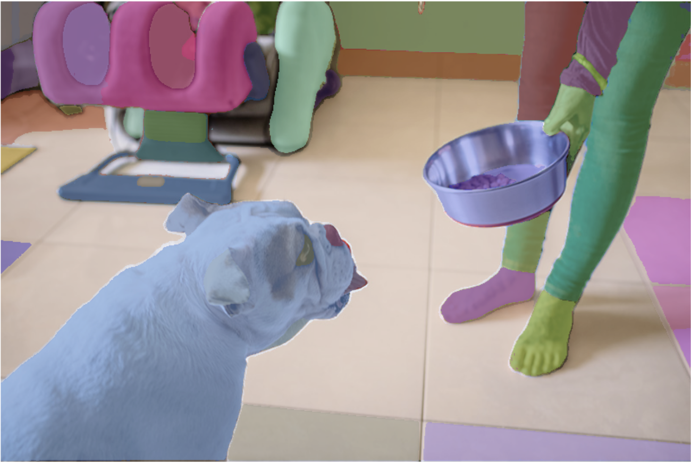

## Segment Anything

The project tests the performance of segmentation techniques on arbitrary 3D shape objects. Please refer to the `notebooks` folder for different use cases and examples.

> [SAM - Official Repo](https://github.com/facebookresearch/segment-anything)
>
> [[`Paper`](https://ai.facebook.com/research/publications/segment-anything/)] [[`Project`](https://segment-anything.com/)] [[`Dataset`](https://segment-anything.com/dataset/index.html)] 


The **Segment Anything Model (SAM)** produces high quality object masks from input prompts such as points or boxes, and it can be used to generate masks for all objects in an image. It has been trained on a [dataset](https://segment-anything.com/dataset/index.html) of 11 million images and 1.1 billion masks, and has strong zero-shot performance on a variety of segmentation tasks.


<p float="left">

  
</p>

### Installation

The code requires `python>=3.8`, as well as `pytorch>=1.7` and `torchvision>=0.8`. Please follow the instructions [here](https://pytorch.org/get-started/locally/) to install both PyTorch and TorchVision dependencies.

```
pip install git+https://github.com/facebookresearch/segment-anything.git
```


### Getting Started

First download a model checkpoint.

Three model versions of the model are available with different backbone sizes.

- **`default` or `vit_h`: [ViT-H SAM model.](https://dl.fbaipublicfiles.com/segment_anything/sam_vit_h_4b8939.pth)**
- `vit_l`: [ViT-L SAM model.](https://dl.fbaipublicfiles.com/segment_anything/sam_vit_l_0b3195.pth)
- `vit_b`: [ViT-B SAM model.](https://dl.fbaipublicfiles.com/segment_anything/sam_vit_b_01ec64.pth)

 Then the model can be used in just a few lines to get masks from a given prompt:

```
from segment_anything import SamPredictor, sam_model_registry
sam = sam_model_registry["<model_type>"](checkpoint="<path/to/checkpoint>")
predictor = SamPredictor(sam)
predictor.set_image(<your_image>)
masks, _, _ = predictor.predict(<input_prompts>)
```

or generate masks for an entire image:

```
from segment_anything import SamAutomaticMaskGenerator, sam_model_registry
sam = sam_model_registry["<model_type>"](checkpoint="<path/to/checkpoint>")
mask_generator = SamAutomaticMaskGenerator(sam)
masks = mask_generator.generate(<your_image>)
```
